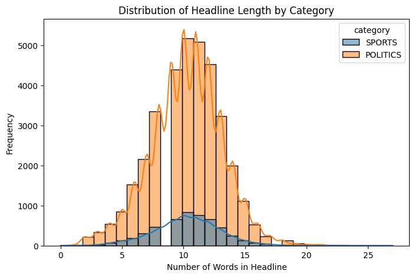
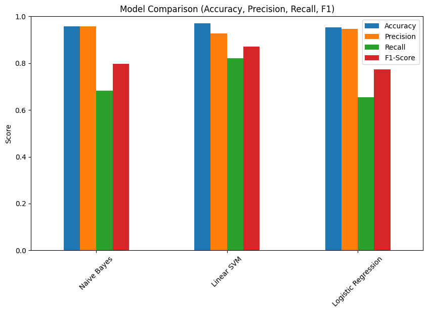

# Sports vs Politics Text Classifier

This project implements a text classifier that predicts whether a text belongs to **Sports** or **Politics**. The system uses three machine learning techniques and TF-IDF vectorization for feature representation.

---

## Dataset

- **Source:** [News Category Dataset v3](https://www.kaggle.com/datasets/rmisra/news-category-dataset)  
- **Categories Used:** `POLITICS` and `SPORTS`  
- **Features:** Headline text  
- **Labels:** Category (`0 → Politics`, `1 → Sports`)  
- **Preprocessing:** Lowercasing, stopword and punctuation removal, lemmatization

Total records: 208108  
Filtered records (Sports + Politics): 40679 

### Class Distribution


### Headline Length Distribution


## Feature Representation

- **TF-IDF Vectorization** with n-grams `(1,2)`  
- Optional Bag-of-Words representation for comparison  
- Preprocessing applied to all headlines before vectorization

---

## Models Compared

1. **Naive Bayes** (TF-IDF)  
2. **Logistic Regression** (TF-IDF)  
3. **Linear SVM** (TF-IDF)  

**Evaluation metrics:** Accuracy, Precision, Recall, F1-Score  

---

## Model Comparison

| Model | Accuracy | Precision | Recall | F1-Score |
|-------|----------|-----------|--------|----------|
| Naive Bayes | 0.956 | 0.957 | 0.682 | 0.796 |
| Linear SVM | **0.970** | 0.927 | **0.821** | **0.870** |
| Logistic Regression | 0.952 | 0.946 | 0.654 | 0.773 |

>  **Observation:** Linear SVM performs best overall, achieving the highest F1-Score and Recall.  
> Naive Bayes has very high precision but lower recall, meaning it is confident in predictions but misses some actual samples.

---

## Insights

- **Linear SVM** → Best overall balance between precision and recall  
- **Naive Bayes** → High precision, low recall (conservative predictions)  
- **Logistic Regression** → Slightly lower recall, good but less robust than SVM  
- Accuracy alone is misleading; F1-Score is a more reliable metric for imbalanced predictions  

---

## Comparison Graphs

  
*Bar chart comparing Accuracy, Precision, Recall, and F1-Score for all models.*

---
## Conclusion

- Linear SVM selected as the **final model**  
- Achieved **97% accuracy** and **0.87 F1-Score**  
- Robust classifier for distinguishing Sports vs Politics headlines  

---

## Usage

1. Clone this repository  
2. Open the notebook in **Google Colab**  
3. Upload the dataset `News_Category_Dataset_v3.json`  
4. Run all cells to train and evaluate the models

### Interactive Prediction Example


### Interactive Prediction Example

```text
Enter a headline (type 'exit' to quit): Government passes new sports funding bill

Predictions:
Naive Bayes: Politics
Logistic Regression: Politics
Linear SVM: Politics

